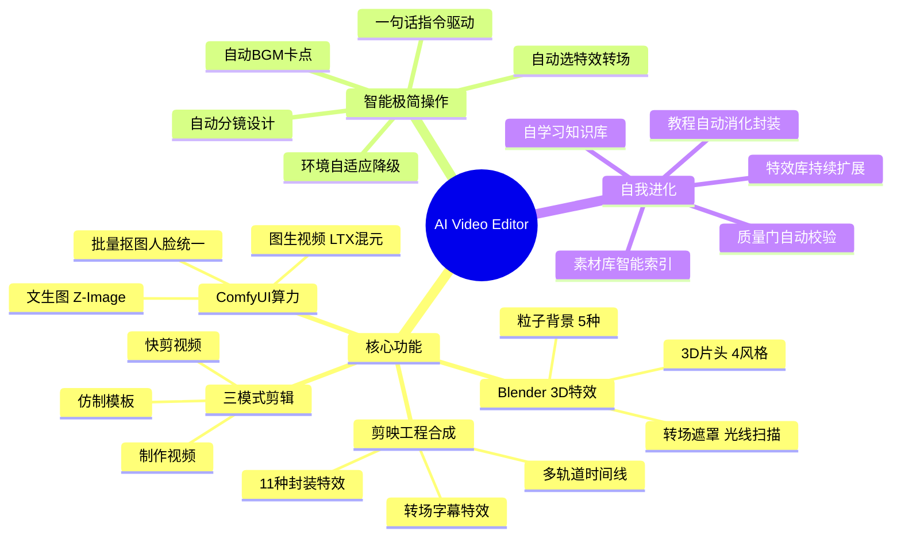

[](https://www.python.org/)
[](LICENSE)
[](https://github.com/comfyanonymous/ComfyUI)
[]()

# AI Video Editor

> **AI 驱动的智能视频剪辑框架** —— 把繁杂的手工剪辑操作变成一句话指令。ComfyUI 算力 + 剪映工程合成 + Blender 3D 特效，全链路自动化。

## 架构脑图



## 核心能力

| 能力 | 说明 |
|------|------|
| **三模式剪辑** | 制作视频 / 快剪视频 / 仿制模板，覆盖从创意到成品的全流程 |
| **ComfyUI 算力** | 文生图、图生视频、批量抠图、人脸统一、角色三视图、图片超分 |
| **剪映工程合成** | 自动生成可直接打开的剪映草稿，多轨道、转场、字幕、特效一键到位 |
| **Blender 3D 特效** | 3D 片头、粒子背景、文字动画、转场遮罩，影视级视觉效果 |
| **智能搜索** | 集成 AnySearch 深度搜索，热点文案、BGM 推荐、剪辑技巧实时检索 |
| **素材库管理** | 逻辑索引 + 质量检测 + 智能筛选，秒级定位合适素材 |
| **质量门体系** | 分镜质量门 + 剪辑质量门，HTML 可视化报告，问题一目了然 |
| **环境自适应** | 自动检测可用组件，能力缺失时智能降级，不中断流程 |

## 三模式剪辑

| 模式 | 触发词 | 流程 |
|------|--------|------|
| **A 制作视频** | 制作视频 / 给图剪视频 | 上传素材 → 分镜设计 → 资产准备 → 剪映工程合成 |
| **⚡ 快剪视频** | 快剪视频 / 快速剪辑 | 模式 A 免确认版，文字说明权重高于素材理解 |
| **B 仿制模板** | 仿制模板 / 复刻视频 | 分析参考视频 → 生成可发布的剪映模板草稿 |

## 算力能力（ComfyUI）

- **视频生成**：LTX I2V/T2V/FLF2V 首尾帧、多镜头批量、混元视频 I2V
- **图片生成**：Z-Image 极速文生图（8 秒/张）、Flux、SDXL
- **图像处理**：批量抠图（BiRefNet/RMBG）、人脸统一（ReActor）、角色三视图（Qwen-Image-Edit）、图片超分（RealESRGAN）

## 快速开始

```bash
# 1. 克隆项目
git clone https://github.com/beimeibeile/ai-video-editor.git
cd ai-video-editor

# 2. 配置环境
cp .env.example .env
# 编辑 .env，填入 API Key 和路径

# 3. 安装依赖
pip install requests pillow numpy

# 4. 验证环境
python -c "from core.environment import env; print(env.get_summary())"
```

## 环境要求

| 组件 | 必需？ | 说明 |
|------|--------|------|
| **Python** | ✅ 必需 | ≥ 3.10 |
| **剪映 5.9** | ⚡ 推荐 | 不安装则只输出方案和素材，不生成剪映草稿 |
| **ComfyUI** | ⚡ 推荐 | 不安装则跳过高算力功能，使用原始素材 |
| **Blender** | ⚡ 推荐 | 不安装则跳过 3D 特效，使用原生片头 |
| **AnySearch API Key** | 可选 | 不配置则跳过网络搜索，使用内置知识 |
| **FFmpeg** | 可选 | 不安装则跳过视频转码/音频提取 |

## 配置说明

复制 `.env.example` 为 `.env` 并配置：

```env
# AnySearch 搜索 API（可选）
ANYSEARCH_API_KEY=as_sk_xxxxxxxxxxxxxxxx
ANYSEARCH_API_ENDPOINT=https://api.anysearch.com

# ComfyUI（可选）
COMFYUI_ENABLED=true
COMFYUI_ADDRESS=127.0.0.1:8188

# 剪映（可选）
JIANYING_ENABLED=true
JIANYING_PATH=C:\path\to\JianyingPro.exe
JIANYING_VERSION=5.9

# Blender（可选）
BLENDER_ENABLED=true
BLENDER_PATH=C:\Program Files\Blender Foundation\Blender 5.2\blender.exe
```

## 项目架构

```
ai-video-editor/
├── capabilities/          # 能力模块（可插拔）
│   ├── cap_comfyui_runner/    # ComfyUI 算力
│   ├── cap_e2e_pipeline/      # 端到端流程
│   ├── cap_env_checker/       # 环境检测
│   ├── cap_blender_runner/    # Blender 合成
│   ├── cap_creative/          # 创意引擎 + 质量门
│   └── cap_asset_library/     # 素材库管理
├── scripts/               # 业务脚本（特效、片头、转场等）
├── core/                  # 核心层（配置、环境、任务路由）
├── knowledge/             # 知识库（自学习）
├── workbench/             # 导演工作台（HTML 交互面板）
└── utils/                 # 工具函数
```

## 依赖项目

- [jianying-editor](https://github.com/) — 剪映 Python API（JyProject）
- [ComfyUI](https://github.com/comfyanonymous/ComfyUI) — 本地 AI 算力
- [AnySearch](https://www.anysearch.com) — 网络搜索 API
- [Blender](https://www.blender.org/) — 3D 合成与特效

## License

[MIT](LICENSE)
